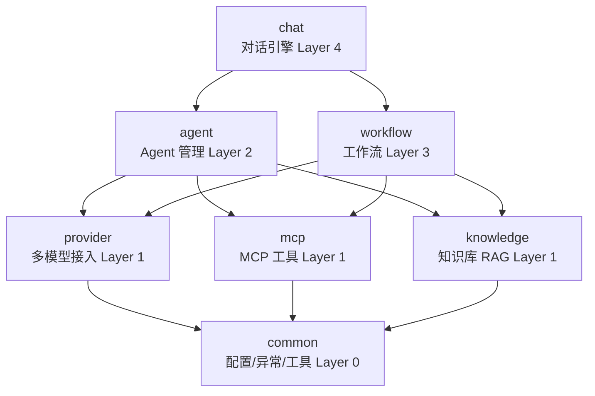
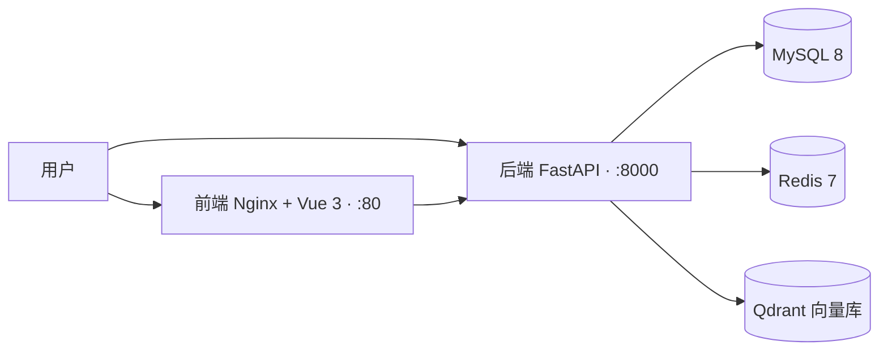

# Hify

> 轻量级模块化 AI Agent 开发平台 —— 一个人开发、一条命令部署：多模型接入、Agent 配置、流式对话、RAG 知识库、工作流编排、MCP 工具调用，全部私有化本地运行。


## ✨ 核心特性

1. **多模型提供商统一接入** —— OpenAI / Anthropic / Gemini / Ollama 接口抽象解耦，业务逻辑与模型实现分离，切换模型零代码改动
2. **三层高可用 LLM 调用架构** —— 独立熔断器 + 指数退避重试 + 并发限流，有效规避第三方接口超时与宕机风险
3. **SSE 流式对话引擎** —— 多轮会话记忆 + Redis 上下文持久化，深度集成 RAG 检索、工作流与 MCP 工具调用
4. **四层单向依赖架构** —— 接口抽象 + 依赖方向管控，模块解耦易扩展，保障代码可维护性
5. **完整工程化与可观测体系** —— 结构化日志 + Grafana 指标可视化 + X-Request-ID 全链路追踪，Docker Compose 一键编排，配套单元测试与集成测试

## 🏗 架构

应用采用四层单向依赖分层架构（依赖只允许自上而下，禁止循环引用）：



部署架构（Docker Compose 一键编排）：



## 🚀 快速开始（3 步）

```bash
# 1. 准备环境变量（数据库/Redis/Qdrant 连接配置）
cp .env.example .env

# 2. 一键启动全部服务（MySQL / Redis / Qdrant / 后端 / 前端）
docker compose up -d

# 3. 打开浏览器
#    前端控制台：http://localhost
#    API 文档：  http://localhost:8000/docs
```

在控制台中添加模型提供商的 API Key，创建 Agent 并绑定工具与知识库，即可开始流式对话。

## 🧰 技术栈

| 层级 | 技术选型 |
|------|---------|
| 后端 | FastAPI + SQLAlchemy |
| 数据库 | MySQL 8.x + Redis 7.x |
| 向量数据库 | Qdrant（Docker 部署） |
| 前端 | Vue 3 + TypeScript + Element Plus |
| 容器化 | Docker + Docker Compose |

## 📂 目录结构

```
app/
├── main.py          # FastAPI 入口
├── common/          # 公共模块（config / exceptions / utils）
├── provider/        # 模型提供商统一接入层
├── mcp/             # MCP 工具接入
├── knowledge/       # 知识库 + RAG
├── agent/           # Agent 管理
├── workflow/        # 工作流编排（JSON 配置，线性 + 条件分支）
└── chat/            # 对话引擎（SSE 流式、多轮记忆）
```
